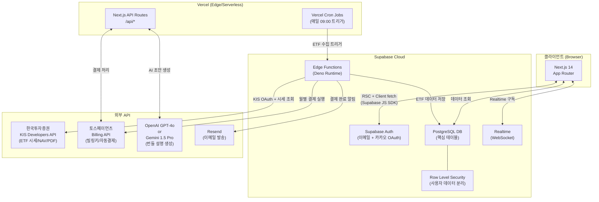
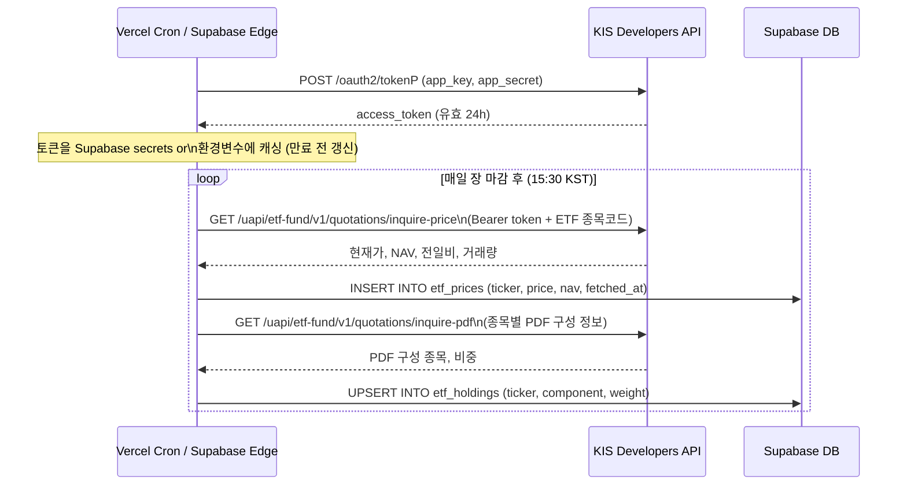
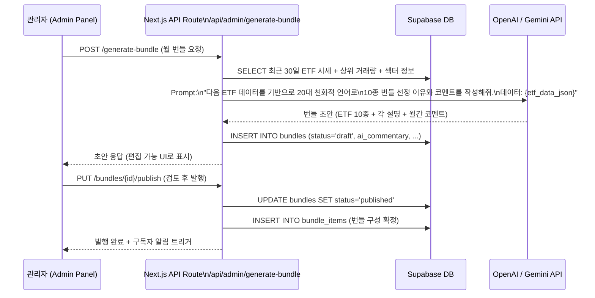
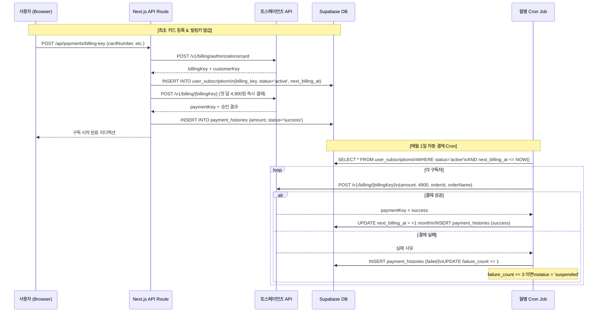
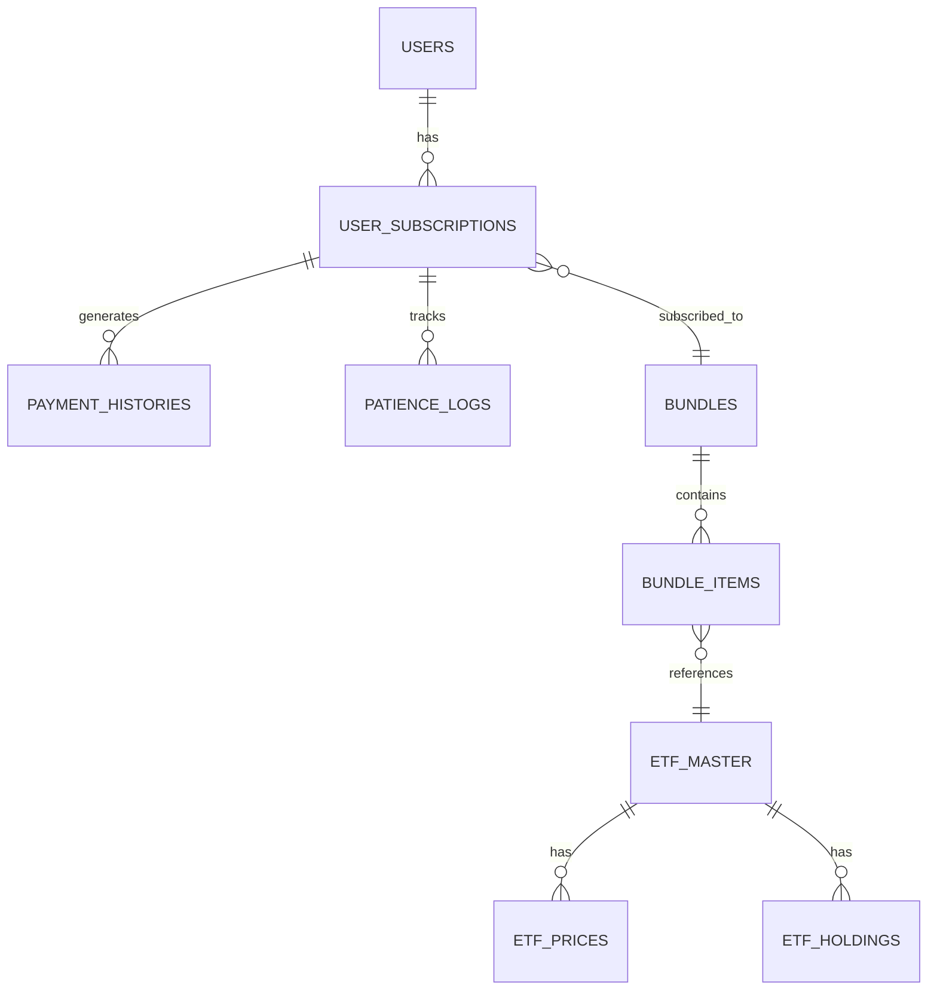

# ARCHITECTURE.md — The Bundle: 시스템 아키텍처 & DB 스키마

> **버전**: v0.1 | **작성일**: 2026-03-12

---

## 1. 전체 시스템 아키텍처



---

## 2. ETF 데이터 수집 파이프라인 (Data Flow)

### 2-A. KIS API 인증 및 토큰 관리



### 2-B. 호출 주기 및 전략

| 데이터 종류 | 호출 빈도 | 저장 방식 |
|-------------|----------|----------|
| ETF 현재가 & NAV | 매일 15:30 KST (장 마감 후) | `etf_prices` 테이블 append |
| PDF (포트폴리오 구성) | 매주 월요일 09:00 | `etf_holdings` upsert |
| 리밸런싱 계획 | 매월 말일 23:00 (번들 준비) | `bundles` draft 생성 |

> **장중 실시간 시세 불필요**: v1은 일별 종가 NAV만 사용하여 KIS API 호출 비용 및 쿼터 최소화.  
> Cron 주체: 평일 장 마감 후 → Vercel Cron, 주말/월말 배치 → Supabase pg_cron (Edge Function 트리거)

### 2-C. 클라이언트 데이터 전달 최적화

```
[Supabase DB] → [Next.js RSC (Server Component)]
  - 번들/ETF 데이터: RSC에서 직접 Supabase query (서버 렌더링)
  - 개인 수익률/기다림 지수: Client Component + Supabase Realtime 구독
  - ETF 현재가 갱신: ISR (revalidate: 3600) 또는 SWR mutate

[최적화 전략]
  1. Bundle 데이터: ISR 캐싱 (1시간), 번들 발행 시 on-demand revalidate
  2. ETF 시세: 클라이언트에서 SWR + Supabase Realtime 구독
  3. 사용자 개인 데이터: SSR with Supabase Auth (RLS 활용)
```

---

## 3. AI 번들 생성 파이프라인



---

## 4. 토스페이먼츠 빌링 결제 흐름



---

## 5. 데이터베이스 스키마 (DB Schema)

### 5-A. 개요 ERD



---

### 5-B. 상세 테이블 정의

#### 📦 `bundles` — 월별 ETF 번들

```sql
CREATE TABLE bundles (
    id              UUID PRIMARY KEY DEFAULT gen_random_uuid(),
    title           TEXT NOT NULL,                    -- "2026년 3월 번들: 안정속의 성장"
    theme           TEXT,                             -- "글로벌 분산 + 배당 안정"
    summary         TEXT,                             -- 20대 친화 요약 (AI 생성)
    ai_commentary   TEXT,                             -- AI 생성 월간 코멘트 (관리자 편집 가능)
    status          TEXT NOT NULL DEFAULT 'draft',   -- 'draft' | 'published' | 'archived'
    published_at    TIMESTAMPTZ,
    valid_from      DATE NOT NULL,                    -- 번들 유효 시작일 (매월 1일)
    valid_until     DATE NOT NULL,                    -- 번들 유효 종료일 (매월 말일)
    created_by      UUID REFERENCES auth.users(id),  -- 관리자 UID
    created_at      TIMESTAMPTZ DEFAULT NOW(),
    updated_at      TIMESTAMPTZ DEFAULT NOW()
);
```

#### 📊 `bundle_items` — 번들 내 ETF 구성

```sql
CREATE TABLE bundle_items (
    id              UUID PRIMARY KEY DEFAULT gen_random_uuid(),
    bundle_id       UUID NOT NULL REFERENCES bundles(id) ON DELETE CASCADE,
    etf_ticker      TEXT NOT NULL,                    -- ETF 종목코드 (예: "360750")
    etf_name        TEXT NOT NULL,                    -- "TIGER 미국S&P500"
    weight          NUMERIC(5,2) NOT NULL,            -- 편입 비중 % (합계 = 100.00)
    rationale       TEXT,                             -- AI 생성 선정 이유 (20대 언어)
    metaphor        TEXT,                             -- 비유 설명 (예: "미국 500대 기업 한번에")
    base_nav        NUMERIC(12,4),                    -- 번들 발행일 기준 NAV (수익률 계산 기준)
    order_index     INT DEFAULT 0,                    -- 카드 표시 순서
    created_at      TIMESTAMPTZ DEFAULT NOW(),
    UNIQUE(bundle_id, etf_ticker)
);
```

#### 💳 `user_subscriptions` — 구독 및 빌링키 관리

```sql
CREATE TABLE user_subscriptions (
    id                  UUID PRIMARY KEY DEFAULT gen_random_uuid(),
    user_id             UUID NOT NULL REFERENCES auth.users(id) ON DELETE CASCADE,
    
    -- 토스페이먼츠 빌링 관련
    billing_key         TEXT,                          -- 토스페이먼츠 빌링키 (암호화 권장)
    customer_key        TEXT UNIQUE,                   -- 토스페이먼츠 customerKey (사용자 식별)
    card_company        TEXT,                          -- 카드사 (예: "신한카드")
    card_number_masked  TEXT,                          -- 마스킹된 카드번호 (예: "****-****-****-1234")
    
    -- 구독 상태
    status              TEXT NOT NULL DEFAULT 'pending',
                                                       -- 'pending' | 'active' | 'suspended' | 'cancelled'
    plan_amount         INT NOT NULL DEFAULT 4900,     -- 월 구독료 (원)
    currency            TEXT NOT NULL DEFAULT 'KRW',
    
    -- 결제 스케줄링
    subscribed_at       TIMESTAMPTZ,                   -- 최초 구독(결제 성공) 시각
    next_billing_at     TIMESTAMPTZ,                   -- 다음 자동 결제 예정 시각
    last_billed_at      TIMESTAMPTZ,                   -- 마지막 성공 결제 시각
    billing_cycle_day   INT DEFAULT 1,                 -- 매월 결제일 (기본 1일)
    
    -- 실패 처리
    failure_count       INT DEFAULT 0,                 -- 연속 결제 실패 횟수
    suspended_at        TIMESTAMPTZ,                   -- 정지된 시각
    cancelled_at        TIMESTAMPTZ,                   -- 해지된 시각
    cancellation_reason TEXT,
    
    -- 구독 번들 추적
    current_bundle_id   UUID REFERENCES bundles(id),  -- 현재 구독 중인 번들
    
    created_at          TIMESTAMPTZ DEFAULT NOW(),
    updated_at          TIMESTAMPTZ DEFAULT NOW(),
    
    UNIQUE(user_id)  -- 사용자당 구독 1개
);

-- 빌링키 보안: Row Level Security
ALTER TABLE user_subscriptions ENABLE ROW LEVEL SECURITY;
CREATE POLICY "users_own_subscription" ON user_subscriptions
    FOR ALL USING (auth.uid() = user_id);
-- billing_key 컬럼은 서버(Edge Function)에서만 SELECT (클라이언트 노출 방지)
```

#### 📈 `patience_logs` — 기다림 지수 기록

```sql
CREATE TABLE patience_logs (
    id                  UUID PRIMARY KEY DEFAULT gen_random_uuid(),
    user_id             UUID NOT NULL REFERENCES auth.users(id) ON DELETE CASCADE,
    subscription_id     UUID NOT NULL REFERENCES user_subscriptions(id),
    
    -- 지수 계산
    patience_score      NUMERIC(5,2) NOT NULL,         -- 0.00 ~ 100.00
    virtual_return_pct  NUMERIC(8,4),                  -- 가상 수익률 % (기준일 대비)
    virtual_amount      NUMERIC(12,2),                 -- 가상 평가금액 (원)
    
    -- 지수 변동 원인
    delta               NUMERIC(5,2),                  -- 전일 대비 지수 변화량
    reason              TEXT,                          -- 변동 사유 (예: "수익 구간 진입 +5pt")
    
    -- 시점
    recorded_date       DATE NOT NULL DEFAULT CURRENT_DATE,
    created_at          TIMESTAMPTZ DEFAULT NOW(),
    
    UNIQUE(user_id, recorded_date)
);

ALTER TABLE patience_logs ENABLE ROW LEVEL SECURITY;
CREATE POLICY "users_own_patience" ON patience_logs
    FOR ALL USING (auth.uid() = user_id);
```

#### 💰 `payment_histories` — 결제 이력

```sql
CREATE TABLE payment_histories (
    id              UUID PRIMARY KEY DEFAULT gen_random_uuid(),
    subscription_id UUID NOT NULL REFERENCES user_subscriptions(id),
    user_id         UUID NOT NULL REFERENCES auth.users(id),
    
    -- 토스페이먼츠 결제 정보
    payment_key     TEXT UNIQUE,                       -- 토스페이먼츠 paymentKey
    order_id        TEXT UNIQUE NOT NULL,              -- 주문번호 (UUID 생성)
    amount          INT NOT NULL,                      -- 결제 금액 (원)
    status          TEXT NOT NULL,                     -- 'success' | 'failed' | 'cancelled'
    failure_code    TEXT,                              -- 실패 코드 (토스페이먼츠 에러코드)
    failure_message TEXT,                              -- 실패 메시지
    
    -- 결제 시점
    billed_at       TIMESTAMPTZ DEFAULT NOW(),
    
    created_at      TIMESTAMPTZ DEFAULT NOW()
);
```

#### 🏷️ `etf_master` — ETF 기본 정보

```sql
CREATE TABLE etf_master (
    ticker          TEXT PRIMARY KEY,                  -- 종목코드 (예: "360750")
    name            TEXT NOT NULL,                     -- "TIGER 미국S&P500"
    name_short      TEXT,                              -- 약칭
    issuer          TEXT,                              -- 운용사 (예: "미래에셋자산운용")
    benchmark_index TEXT,                              -- 추종 지수
    category        TEXT,                              -- 섹터/테마 분류
    exchange        TEXT DEFAULT 'KRX',                -- 거래소
    is_active       BOOLEAN DEFAULT TRUE,
    created_at      TIMESTAMPTZ DEFAULT NOW(),
    updated_at      TIMESTAMPTZ DEFAULT NOW()
);
```

#### 📉 `etf_prices` — ETF 일별 시세

```sql
CREATE TABLE etf_prices (
    id          BIGSERIAL PRIMARY KEY,
    ticker      TEXT NOT NULL REFERENCES etf_master(ticker),
    price_date  DATE NOT NULL,
    close_price NUMERIC(12,4) NOT NULL,                -- 종가
    nav         NUMERIC(12,4),                         -- NAV
    prev_close  NUMERIC(12,4),                         -- 전일 종가
    change_pct  NUMERIC(8,4),                          -- 전일 대비 등락률
    volume      BIGINT,                                -- 거래량
    fetched_at  TIMESTAMPTZ DEFAULT NOW(),
    
    UNIQUE(ticker, price_date)
);

-- 시세 조회 최적화 인덱스
CREATE INDEX idx_etf_prices_ticker_date ON etf_prices(ticker, price_date DESC);
```

---

## 6. Supabase RLS 보안 정책 요약

| 테이블 | 읽기(SELECT) | 쓰기(INSERT/UPDATE) |
|--------|-------------|---------------------|
| `bundles` | 모두 (published만) | 관리자만 |
| `bundle_items` | 모두 | 관리자만 |
| `user_subscriptions` | 본인만 | 서버(Service Role)만 |
| `patience_logs` | 본인만 | 서버(Service Role)만 |
| `payment_histories` | 본인만 | 서버(Service Role)만 |
| `etf_prices` | 모두 | 서버(Service Role)만 |

---

## 7. 환경 변수 목록

```env
# Supabase
NEXT_PUBLIC_SUPABASE_URL=
NEXT_PUBLIC_SUPABASE_ANON_KEY=
SUPABASE_SERVICE_ROLE_KEY=          # 서버 전용 (클라이언트 노출 금지)

# 한국투자증권 KIS
KIS_APP_KEY=
KIS_APP_SECRET=
KIS_ACCOUNT_NUMBER=

# 토스페이먼츠
TOSS_CLIENT_KEY=                    # 클라이언트용 (NEXT_PUBLIC_ 가능)
TOSS_SECRET_KEY=                    # 서버 전용

# AI
OPENAI_API_KEY=
GEMINI_API_KEY=

# 이메일
RESEND_API_KEY=

# Cron 보안
CRON_SECRET=                        # Vercel Cron 인증 헤더
```
