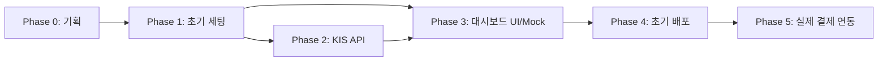

# TASKS.md — The Bundle: 단계별 구현 작업 목록

> **규칙**: 각 Task는 Antigravity가 독립적으로 실행 및 검증 가능한 단위.  
> 상태 표시: `[ ]` 미착수 | `[/]` 진행 중 | `[x]` 완료
> **알림**: 토스페이먼츠 실제 연동(Phase 5)은 사업체 등록 후 진행할 예정입니다. 초기 개발 단계에서는 UI와 흐름은 결제를 고려하되, 실제 결제 로직은 Mock으로 처리합니다.

---

## Phase 0: 기획 완료 (Planning)
- [x] PRD.md 작성 (스토리보드, 기능 정의, 기술 스택)
- [x] ARCHITECTURE.md 작성 (데이터 흐름, DB 스키마, RLS 정책)
- [x] TASKS.md 작성 (본 문서)
- [ ] **사용자 승인 후 Phase 1 진입**

---

## Phase 1: 프로젝트 초기 세팅 & DB 스키마

### 1-1. Next.js 프로젝트 초기화
- [x] `npx create-next-app@latest ./ --typescript --tailwind --app --eslint` 실행
- [x] 필요 패키지 설치: `@supabase/supabase-js`, `@supabase/ssr`, `shadcn/ui`
- [x] `.env.local` 파일 생성 및 Supabase 환경변수 설정
- [x] `src/lib/supabase/client.ts`, `server.ts`, `middleware.ts` 유틸 생성
- [x] **검증**: `npm run dev` 후 `http://localhost:3000` 정상 렌더링 확인

### 1-2. Supabase 프로젝트 세팅
- [x] Supabase 대시보드에서 신규 프로젝트 생성
- [x] SQL Editor에서 마이그레이션 실행:
  - `etf_master`, `etf_prices`, `etf_holdings` 테이블 생성
  - `bundles`, `bundle_items` 테이블 생성
  - `user_subscriptions`, `payment_histories` 테이블 생성
  - `patience_logs` 테이블 생성
- [x] RLS 정책 적용 (ARCHITECTURE.md 6절 기준)
- [x] **검증**: Supabase Table Editor에서 7개 테이블 및 RLS 상태 확인

### 1-3. Supabase Auth 세팅
- [x] 이메일/비밀번호 Auth Provider 활성화
- [ ] 카카오 소셜 로그인 OAuth 설정 (보류)
- [x] `/auth/login`, `/auth/signup`, `/auth/callback` 페이지 구현
- [x] Next.js Middleware로 `/dashboard`, `/admin` 라우트 보호
- [x] **검증**: 가입 → 로그인 → 대시보드 리디렉션 E2E 흐름 테스트

### 1-4. 기본 레이아웃 & 공통 컴포넌트
- [x] 글로벌 폰트 설정 (Outfit, Inter)
- [x] `Header`, `Footer`, `Sidebar` 레이아웃 컴포넌트
- [x] 공통 Button, Card, Badge, LoadingSpinner UI 컴포넌트 (shadcn/ui 기반)
- [x] **검증**: 시각적 체크 완료

---

## Phase 2: KIS API 연동 & ETF 데이터 수집

### 2-1. KIS OAuth 토큰 관리
- [x] `src/lib/kis/auth.ts`: KIS app_key/secret으로 access_token 발급 함수 구현
- [x] 토큰 만료(24h) 전 자동 갱신 로직 (메모리 캐싱 우선 구현)
- [x] **검증**: 유닛 테스트 완료

### 2-2. ETF 시세 수집 서비스
- [x] `src/lib/kis/etf.ts`: 종목코드 배열을 받아 현재가/NAV 조회 함수 구현
- [x] ETF PDF(포트폴리오 구성) 조회 함수 구현
- [x] **검증**: KIS Sandbox 환경에서 360750 등 조회 로직 검증

### 2-3. 데이터 수집 스케줄러 구현
- [x] `src/services/etf-collection.ts`: KIS API 호출 → DB INSERT 서비스 구현
- [x] `/api/cron/fetch-etf` 라우트 생성 (CRON_SECRET 인증)
- [x] **검증**: `scripts/test-fetch.ts`를 통한 수동 실행 및 성공 확인

### 2-4. ETF 마스터 데이터 초기 적재
- [x] SQL을 통한 초기 ETF 10종 마스터 데이터 적재
- [x] **검증**: `etf_master` 테이블 적재 확인

---

## Phase 3: 번들 대시보드 UI & 기다림 지수 (Mock 결제 연동)

### 3-1. 랜딩 페이지 및 구독 유도
- [x] `/` 페이지: 서비스 소개, CTA
- [x] 구독 프로세스 UI: Mock 구독 액션 (`createMockSubscription`) 구현
- [x] **검증**: 비구독자 -> 구독 신청(Mock) -> 대시보드 전환 확인

### 3-2. 번들 대시보드 구현
- [x] `/dashboard` 페이지: 프리미엄 레이아웃 및 큐레이션 번들 섹션
- [x] ETF 카드 컴포넌트: 비유 설명, 비중 확인 UI
- [x] 구독자 전용 잠금 해제 로직 구현
- [ ] Supabase Realtime으로 ETF 가격 실시간 갱신 구독 (후순위)
- [x] **검증**: 구독자용 대시보드 정상 렌더링 확인

### 3-3. 가상 수익률 트래킹
- [x] 구독 시작일의 번들 base_nav를 기준으로 현재 NAV 비교 계산 함수
- [x] `/dashboard/performance` 페이지: 가상 수익률 차트
- [x] **검증**: 수익률 계산 및 차트 렌더링 검증 완료

### 3-4. 기다림 지수 (Patience Gauge)
- [x] `patience_logs` 일별 계산 로직 구현 (Edge Function 또는 API Route)
- [x] 원형 게이지 UI 컴포넌트 (SVG + 애니메이션)
- [x] 단계별 뱃지 시스템: 씨앗(0~25) → 새싹(26~50) → 나무(51~75) → 현인(76~100)
- [ ] **검증**: 기간별 케이스 시나리오 단위 테스트 (1개월, 3개월, 12개월)

### 3-5. AI 번들 생성 및 관리자 패널
- [x] `POST /api/admin/generate-bundle` API Route: Gemini 연동
- [x] `/admin`: AI 번들 초안 생성 UI 구현
- [ ] 발행 워크플로우: Draft -> Published 상태 전이 (편집 기능 포함 보완 필요)
- [x] **검증**: AI 초안 생성 및 DB 저장 확인

---

## Phase 4: 마무리 & 초기 배포

### 4-1. 보안 강화 및 최적화
- [x] Supabase RLS 정책 최종 검증 및 강화
- [x] Next.js Metadata (SEO) 및 robots.txt, sitemap.ts 적용
- [x] 폰트 및 이미지 최적화 (Outfit/Inter 적용)
- [ ] **검증**: Lighthouse Performance 점수 90+ 확인 (배포 후)

### 4-2. 초기 배포 및 모니터링
- [x] `vercel.json` 설정 (Cron: 평일 15:30)
- [ ] Vercel 프로젝트 생성 및 초기 배포 실행 (관리자 설정 필요)
- [ ] Sentry 에러 모니터링 연동 제안 및 가이드

---

## Phase 5: [보류] 토스페이먼츠 실제 정기결제 연동

### 5-1. 토스페이먼츠 SDK 및 환경 설정
- [ ] 실제 클라이언트/시크릿 키 발급 및 적용
- [ ] 테스트 환경 -> 운영 환경 전환 설정

### 5-2. 빌링키 발급 및 실제 결제 구현
- [ ] 토스페이먼츠 빌링 위젯 실제 연동
- [ ] `POST /api/payments/billing-key`: 실제 카드 인증 및 첫 결제 로직 활성화
- [ ] **검증**: 실제 테스트 카드로 결제 성공 및 DB 상태 확인

### 5-3. 자동 결제 스케줄러 및 웹훅
- [ ] 매월 1일 자동 결제 Cron 로직 활성화
- [ ] 웹훅 핸들러를 통한 실제 결제 결과 (성공/실패/취소) 처리
- [ ] **검증**: 웹훅 이벤트에 따른 구독 상태(Suspended 등) 전이 확인

---

## 의존성 요약

